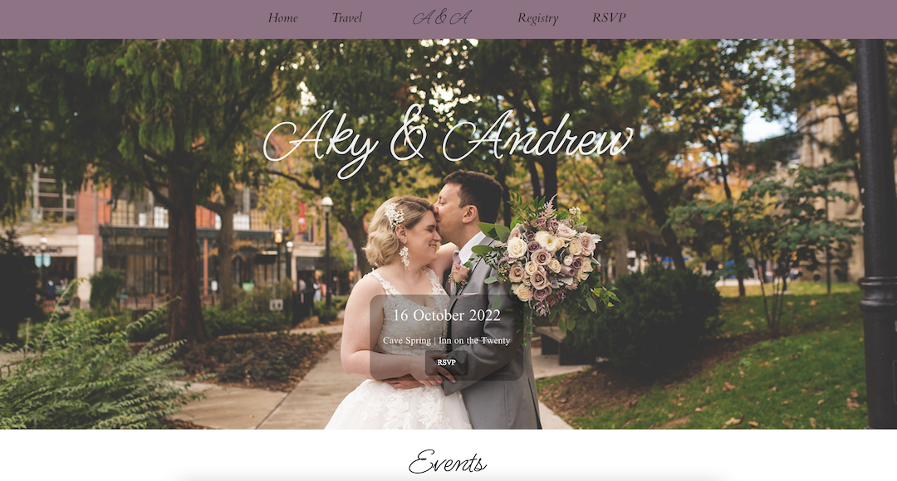
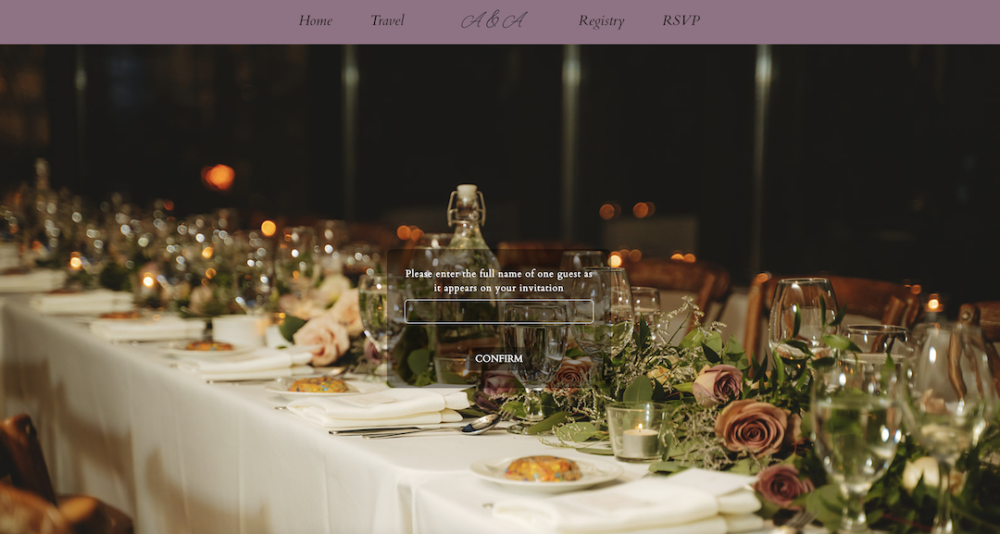

# My Wedding Website

Visit the live site!
[akyandrew2022.com](http://akyandrew2022.com)

A website for my wedding.
A collaboration between [Aky Mac Donald](https://github.com/solidquartz) (Front End with some Back End database work) and [Kevin Bernfeld](https://github.com/myopicmage) (Back End)
Guests can RSVP, view event details, and find information about travel and the gift registry.

## RSVP Feature

Reusable forms with validation were built with Formik and Yup, including elements from Chakra UI mixed with bespoke CSS. The forms use a fuzzy search to grab parties from the database. Components are used to achieve a seamless experience for the user, and keep code DRY for the developer. 
Because forms are arguably one of the more frustrating features to develop in React, I employed Formik and Yup to make the experience much easier, less buggy, and reusable. I'm very pleased with how they turned out!

The names of each guest in the party are pre-filled in the RSVP form. Based on the type of guest, child or adult, the forms will pre-fill, ensuring each guest can choose the correct meal options. If the user types their name incompletely or incorrectly, there is the option to start over. Validation is used precisely to ensure the correct data is entered for each guest and nothing is missing. Nothing worse than showing up to a wedding and getting the child's menu when you wanted the chicken, am I right?

## Tech Stack
### Front End
- Typescript
- React
- Sass
- Chakra UI
- Formik
- Yup

### Back End
[The backend repo is found here](https://github.com/doginasweater/akywedding-backend)
- C#
- .NET
- Entity Framework

The backend was set up and written by Kevin Bernfeld, who mentored me through basic knowledge of C# and .NET so I could create the admin dashboard on the frontend where I created numerous database calls. More details on the dashboard coming soon.
